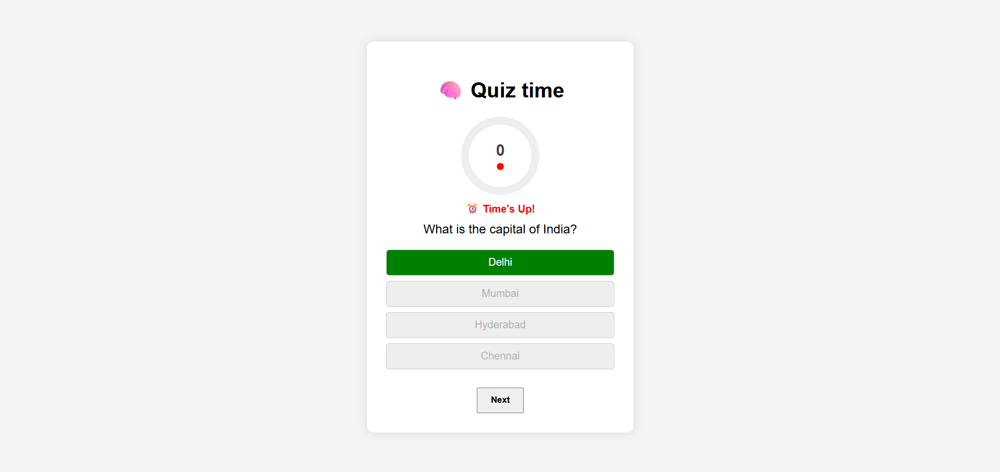

# 🧠 JavaScript Quiz App

An interactive, timed multiple-choice **Quiz App** built using **Vanilla JavaScript**, HTML, and CSS.

This project challenges your understanding of core JavaScript concepts like DOM manipulation, event handling, arrays, timers, and user input — all without using any frameworks.

---

## 🚀 Live Demo

👉 [Click here to try the quiz](https://github.com/Rushyanjankarthik25/Quiz-App.git)

---

## 🧩 Features

- ✅ Dynamic multiple-choice questions
- ✅ Answer selection with instant feedback
- ✅ Score tracking and final result screen
- ✅ "Next" button to move between questions
- ✅ **Per-question timer (10 seconds)**
- ✅ Auto-submits when time runs out
- ✅ Restart quiz button
- ✅ Responsive and clean design

---

## 🛠️ Built With

- **HTML5** – Structure
- **CSS3** – Styling and layout
- **Vanilla JavaScript** – Logic, state management, timers

---

## 📁 Folder Structure

quiz-app/
├── index.html # HTML structure
├── style.css # UI styling and animation
├── script.js # App logic and interactivity
└── README.md # Project description

---

## 📸 Preview

---

## ✍️ Author

**Rushyanjan Karthik**  
🔗 [GitHub Profile](https://rushyanjankarthik25.github.io/Quiz-App/)

---

## 💡 What I Learned

- Using arrays and objects to manage quiz data
- DOM manipulation for dynamic content
- Working with `setInterval` and `clearInterval`
- Event-driven UI logic and game flow control
- Basic UI/UX principles for interactivity

---

## 📌 License

This project is open-source and free to use.  
You’re welcome to improve it or fork it for learning!
